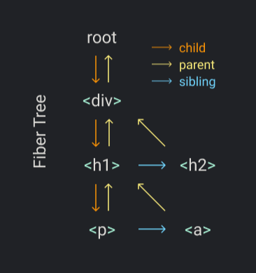

```bash
Didact.render(
  <div>
    <h1>
      <p />
      <a />
    </h1>
    <h2 />
  </div>,
  container
)
```


In the render we’ll create the root fiber and set it as the nextUnitOfWork. The rest of the work will happen on the performUnitOfWork function, there we will do three things for each fiber:

    1.add the element to the dom
    2.create the fibers for the element’s children
    3.select the next unit of work

One of the goals of this data structure is to make it easy to find the next unit of work. 
**That’s why each fiber has a link to its first child, its next sibling and its parent.**

When we finish performing work on a fiber, if it has a child that fiber will be the next unit of work.

From our example, when we finish working on the div fiber the next unit of work will be the h1 fiber.

If the fiber doesn’t have a child, we use the sibling as the next unit of work.

For example, the p fiber doesn’t have a child so we move to the a fiber after finishing it.

And if the fiber doesn’t have a child nor a sibling we go to the “uncle”: the sibling of the parent. Like a and h2 fibers from the example.

Also, if the parent doesn’t have a sibling, we keep going up through the parents until we find one with a sibling or until we reach the root. If we have reached the root, it means we have finished performing all the work for this render.

西安渲染当前节点，完成之后在渲染children节点；若没有children节点，渲染sibling兄弟节点；若没有children节点也没有sibling节点，寻找父节点的sibling;若父节点没有sibling节点，继续向上查找知道寻到存在sibling的父节点，直到root节点

```bash
function render(element, container) {
  const dom =
    element.type == "TEXT_ELEMENT"
      ? document.createTextNode("")
      : document.createElement(element.type)
​
  const isProperty = key => key !== "children"
  Object.keys(element.props)
    .filter(isProperty)
    .forEach(name => {
      dom[name] = element.props[name]
    })
​
  element.props.children.forEach(child =>
    render(child, dom)
  )
​
  container.appendChild(dom)
}
​
let nextUnitOfWork = null
```
In the render function we set nextUnitOfWork to the root of the fiber tree.
```bash
ction render(element, container) {
  nextUnitOfWork = {
    dom: container,
    props: {
      children: [element],
    },
  }
}
​
let nextUnitOfWork = null
```

Then, when the browser is ready,it will call our workLoop and we’ll start working on the root.
```bash
function workLoop(deadline) {
  let shouldYield = false
  while (nextUnitOfWork && !shouldYield) {
      // 
    nextUnitOfWork = performUnitOfWork(
      nextUnitOfWork
    )
    shouldYield = deadline.timeRemaining() < 1
  }
  requestIdleCallback(workLoop)
}
​
requestIdleCallback(workLoop)
​// 
function performUnitOfWork(fiber) {
  // TODO add dom node
  // TODO create new fibers
  // TODO return next unit of work
}
```
First, we create a new node and append it to the dom.

We keep track of the dom node in the fiber.dom property.
```bash
function performUnitOfWork(fiber) {
  if (!fiber.dom) {
    fiber.dom = createDom(fiber)
  }
​
  if (fiber.parent) {
    fiber.parent.dom.appendChild(fiber.dom)
  }
​
  // TODO create new fibers
  // TODO return next unit of work
}
```
Then for each child we create a new fiber.
```bash
  const elements = fiber.props.children
  let index = 0
  let prevSibling = null
​
  while (index < elements.length) {
    const element = elements[index]
​
    const newFiber = {
      type: element.type,
      props: element.props,
      parent: fiber,
      dom: null,
    }
  }
```
And we add it to the fiber tree setting it either as a child or as a sibling, depending on whether it’s the first child or not.
```bash
  if (index === 0) {
      fiber.child = newFiber
    } else {
      prevSibling.sibling = newFiber
    }
​
    prevSibling = newFiber
    index++
  }
```

**Finally we search for the next unit of work. We first try with the child, then with the sibling, then with the uncle, and so on.**
```bash
  if (fiber.child) {
    return fiber.child
  }
  let nextFiber = fiber
  while (nextFiber) {
    if (nextFiber.sibling) {
      return nextFiber.sibling
    }
    nextFiber = nextFiber.parent
  }
}
```
that’s our performUnitOfWork.
```bash
function performUnitOfWork(fiber) {
    if (!fiber.dom) {
        fiber.dom = createDom(fiber)
    }​
    if (fiber.parent) {
        fiber.parent.dom.appendChild(fiber.dom)
    }​
    const elements = fiber.props.children
    let index = 0
    let prevSibling = null​
    while (index < elements.length) {
        const element = elements[index]​
        const newFiber = {
            type: element.type,
            props: element.props,
            parent: fiber,
            dom: null,
        }​
        if (index === 0) {
            fiber.child = newFiber
        } else {
            prevSibling.sibling = newFiber
        }​
        prevSibling = newFiber
        index++
    }​
    if (fiber.child) {
        return fiber.child
    }
    let nextFiber = fiber
    while (nextFiber) {
        if (nextFiber.sibling) {
            return nextFiber.sibling
        }
        nextFiber = nextFiber.parent
    }
}
```